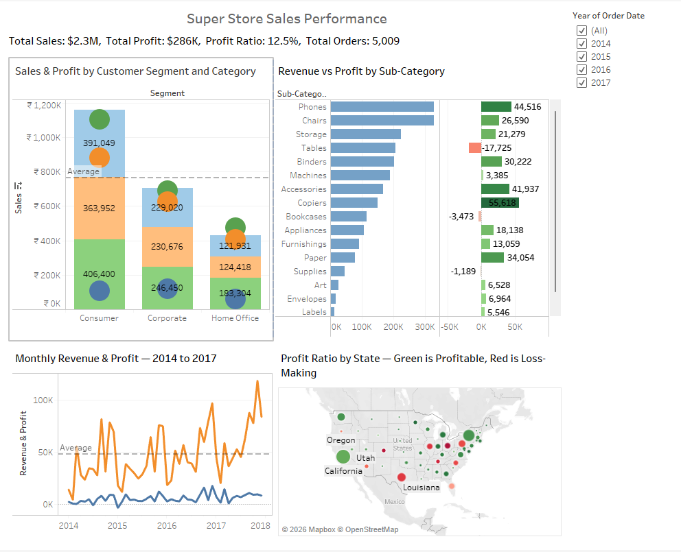
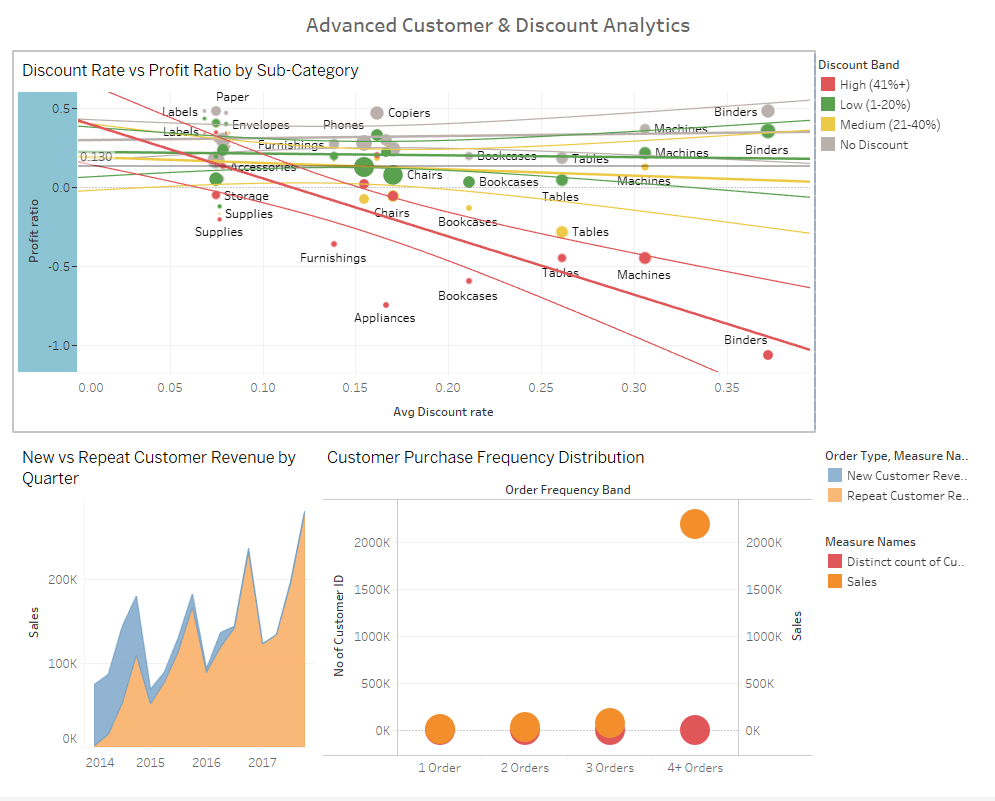

# Superstore Sales Performance Dashboard
### Tableau | LOD Expressions | Dashboard Actions | Superstore Dataset

---

## Business Problem

A retail manager needs a single screen to answer: *"What's working, what isn't, and where should I focus?"*

Without a centralised view, performance monitoring is scattered across spreadsheets, regional reports and product lists — making it impossible to spot trends, compare segments or make fast decisions.

This project delivers a two-dashboard Tableau workbook covering revenue trends, regional performance, customer segmentation, and advanced analytics including discount impact and customer retention patterns.

---

## Dataset

**Source:** [Superstore Sales Dataset — Kaggle](https://www.kaggle.com/datasets/vivek468/superstore-dataset-final)

| Property | Detail |
|---|---|
| File format | .csv |
| Records | 9,994 orders |
| Date range | 2014 – 2017 |
| Region | United States |
| Categories | Furniture, Office Supplies, Technology |
| Customer Segments | Consumer, Corporate, Home Office |

> **Note:** Dataset not included in this repo. Download directly from the Kaggle link above.

---

## Dashboards

### Dashboard 1 — Sales Performance Overview

An executive-level overview of business performance across four views with global filters and cross-dashboard actions.



**Contains:**
- Revenue & Profit Trend — dual axis line chart showing monthly Sales vs Profit with reference line at average
- Sales & Profit by Sub-Category — side by side bar chart with profit coloured red/green by positive/negative margin
- Regional Performance Map — filled map of US states coloured by Profit Ratio (Profit/Sales) with Sales on size
- Customer Segment Analysis — stacked bar chart of Sales and Profit by Segment and Category

**Interactive features:**
- Global filters for Year, Region and Segment — apply across all four sheets simultaneously
- Click any state on the map to filter all other charts
- Click any segment bar to filter the trend line and sub-category chart
- Navigation button to Dashboard 2

---

### Dashboard 2 — Advanced Customer & Discount Analytics

LOD expression-driven analysis revealing the business's retention problem and discount policy damage.



**Contains:**
- New vs Repeat Customer Revenue — area chart by quarter showing revenue split between first-time and returning customers
- Customer Purchase Frequency — bar chart showing how many customers bought once, twice, three times, or four or more times
- Discount Impact on Profit — scatter plot of every Sub-Category's average discount rate vs profit ratio with trend line

**Interactive features:**
- Click a frequency bar to filter the revenue trend view
- Hover over frequency bars to highlight corresponding discount behaviour
- Navigation button back to Dashboard 1

---

## Sheets & Techniques

| Sheet | Chart Type | Key Technique |
|---|---|---|
| Revenue & Profit Trend | Dual axis line | Synchronised axis, reference line |
| Sales & Profit by Sub-Category | Side by side bar | Diverging colour on profit |
| Regional Performance Map | Filled map | Profit Ratio calculated field |
| Customer Segment Analysis | Stacked bar | Dual axis for profit overlay |
| Customer Purchase Frequency | Bar | FIXED LOD expression |
| New vs Repeat Revenue | Area | FIXED LOD + Table Calculation |
| Discount Impact on Profit | Scatter | FIXED LOD + Trend line |

---

## LOD Expressions Used

**Orders Per Customer**
```
{ FIXED [Customer ID] : COUNTD([Order ID]) }
```
Calculates order count per customer independent of view dimensions.

**Customer First Order Date**
```
{ FIXED [Customer ID] : MIN([Order Date]) }
```
Tags every order row with that customer's first ever purchase date.

**Avg Discount by Sub-Category**
```
{ FIXED [Sub-Category] : AVG([Discount]) }
```
Pins average discount at Sub-Category level for scatter plot accuracy.

**Discount Band**
```
IF { FIXED [Order ID] : MAX([Discount]) } = 0 THEN "No Discount"
ELSEIF { FIXED [Order ID] : MAX([Discount]) } <= 0.2 THEN "Low (1-20%)"
ELSEIF { FIXED [Order ID] : MAX([Discount]) } <= 0.4 THEN "Medium (21-40%)"
ELSE "High (41%+)"
END
```
Evaluates discount at Order ID level to avoid distortion from view dimensions.

---

## Key Findings

### 1. Tables and Binders are destroying margin
High discount rates on Tables and Binders make them systematically loss-making despite strong sales volume. The scatter plot shows a clear linear relationship — every increase in discount rate correlates directly with lower profit ratio.

### 2. The West is the most profitable region
West Coast states consistently show the highest profit ratios on the map. Texas and Illinois show negative profit ratios despite high sales volume — driven by excessive discounting in those markets.

### 3. Most customers buy only once
The frequency distribution shows the vast majority of customers in the "1 Order" bucket. The New vs Repeat Revenue chart confirms the business is almost entirely acquisition-dependent with minimal repeat purchase behaviour.

### 4. Home Office has the best profit ratio
Despite being the smallest segment by volume, Home Office customers show the strongest profit ratio — fewer but more deliberate purchases with less discounting.

---

## How to Open

1. Download and install [Tableau Desktop](https://www.tableau.com/products/desktop) or [Tableau Public](https://public.tableau.com)
2. Clone or download this repo
3. Open `superstore_dashboard.twbx` — the dataset is bundled inside the packaged workbook, no separate download needed

---

## Live Dashboard

> Coming Soon — will be published to Tableau Public

---

## Repository Structure

```
tableau-superstore-sales-analytics/
│
├── README.md
├── superstore_dashboard.twbx
│
└── screenshots/
    ├── dashboard1_overview.png
    └── dashboard2_advanced.png
```

---

Analysis by Pranesh Yuvaraj | linkedin.com/in/pranesh-yuvaraj
